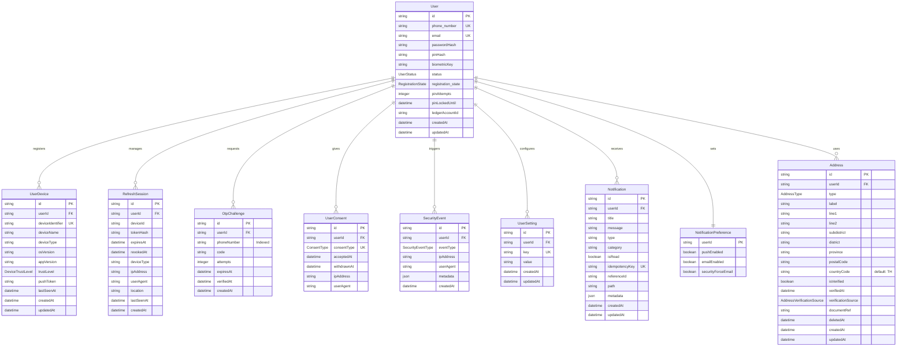
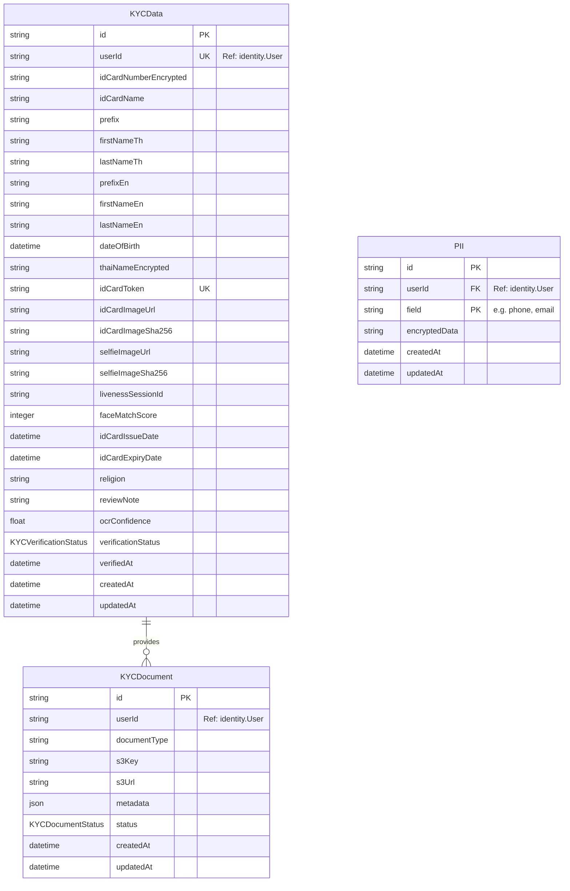
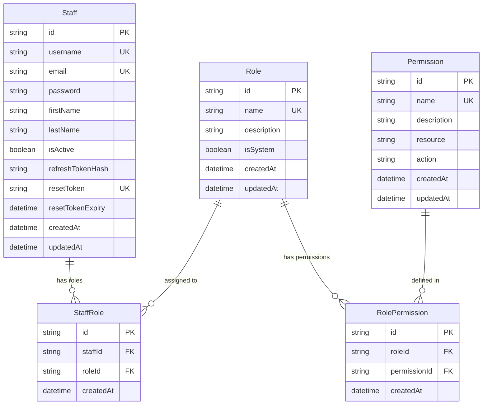
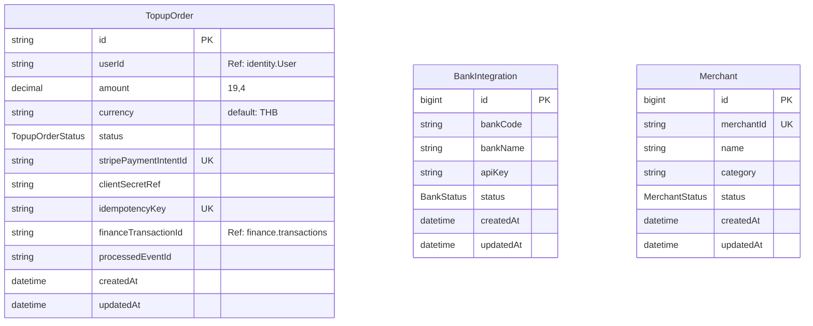
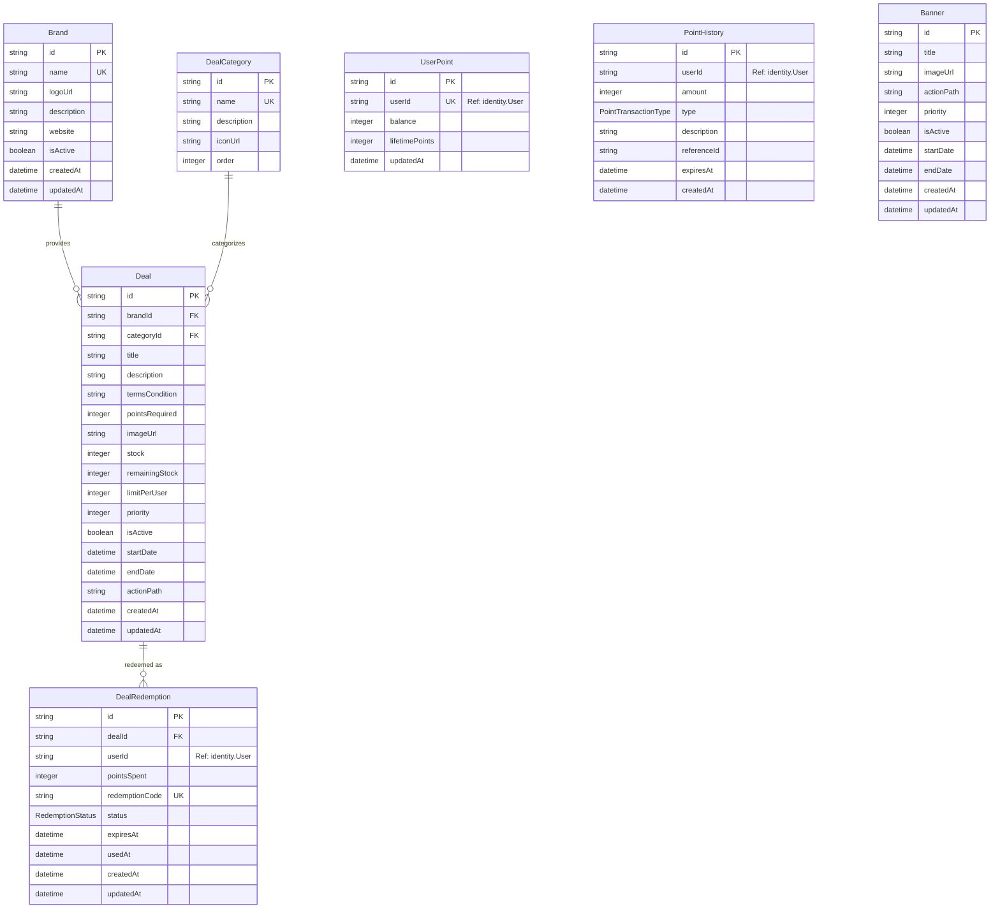
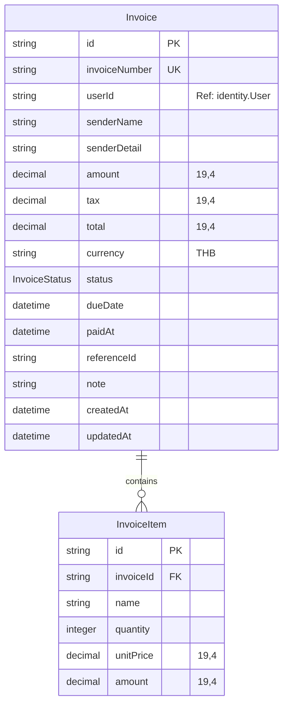
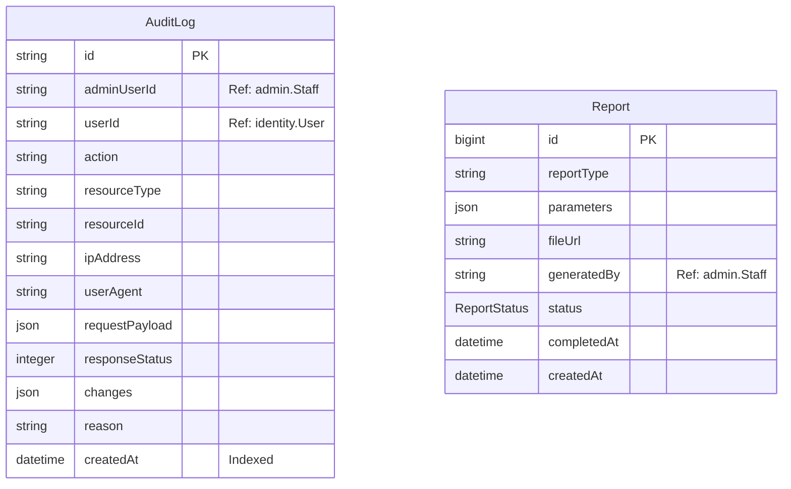

# J-Ledger Database Diagram (Complete Master v1.8.4)

เอกสารนี้รวบรวมโครงสร้างฐานข้อมูลแบบ **สมบูรณ์ 100%** ครบถ้วนทุกตารางและคอลัมน์ แบ่งตาม 8 Physical Schemas

---

## 🏛️ 1. Finance Schema (`finance`)
จัดเก็บข้อมูลการเงินและระบบตรวจสอบ (Double-Entry Accounting) - *Managed by finance-service*

<b>ขยายดูรายละเอียด Finance Schema (14 Tables)</b>

[🔍 Open in Full Screen (Zoomable)](https://mermaid.live/edit#pako:eNptksFuwyAMhl_F8nmX9gDNoUonrVInDbtMvSAXmkhREpAsq_bdZ9pUu20nI-z_N7Y_G8NoVSRGZ3X_YjX3W0uL270mRlsjR8G_XN0v3-7uF09Pe0NcNkaOg3v89nh7tT_tH_YvHsc7M0fBkZ264e1_e_76vH_Yv7kfN_ZWhSOf2qHz_3OOf8u9mNqBf26HyrU_8T_m38p24B97G_CHHn_vH_L6_vYn8O8O51WOn9v_1x_p6-90_N9V6T9VpU9Y-Q_m6T-Yh6_P-Vn9_Kx-fFY_P6sfntWPz-r_AK-Nf1w)

```mermaid
erDiagram
    wallets ||--o{ transactions : "from/to"
    wallets ||--|| reward_accounts : "linked"
    accounts ||--o{ internal_ledger_entries : "audit trail"
    accounts ||--o{ payment_transactions : "syncs"
    accounts ||--o{ transaction_limits : "limits"
    
    wallets {
        bigint id PK
        varchar user_id UK "Logical Link: identity.User"
        varchar wallet_id UK "Public ID"
        decimal balance "19,4"
        varchar currency
        varchar status
        decimal daily_limit
        decimal monthly_limit
        integer version
        timestamp created_at
        timestamp updated_at
    }

    transactions {
        bigint id PK
        varchar transaction_id UK
        bigint from_wallet_id FK
        bigint to_wallet_id FK
        varchar type
        decimal amount
        decimal fee
        varchar status
        text description
        jsonb metadata
        timestamp created_at
        timestamp completed_at
    }

    accounts {
        uuid id PK
        uuid user_id FK
        varchar account_name
        decimal balance "20,4"
        varchar status
        varchar kyc_status
        timestamp kyc_review_date
        integer version
        timestamp created_at
        timestamp updated_at
    }

    internal_ledger_entries {
        uuid id PK
        uuid account_id FK
        varchar entry_type "DEBIT, CREDIT"
        decimal amount "20,4"
        timestamp created_at
    }

    payment_transactions {
        uuid id PK
        uuid account_id FK
        varchar reference_id UK
        varchar type
        decimal amount
        varchar status
        timestamp created_at
    }

    transaction_limits {
        uuid id PK
        uuid account_id FK
        varchar limit_type
        decimal limit_amount
        decimal current_amount
        timestamp reset_date
        boolean is_active
        timestamp created_at
    }

    reward_accounts {
        uuid account_id PK "Ref accounts.id"
        decimal points_balance
        timestamp updated_at
    }

    linked_bank_accounts {
        bigint id PK
        varchar user_id "Ref identity.User"
        varchar bank_code
        varchar account_number
        boolean is_default
        boolean is_verified
        timestamp created_at
    }

    suspicious_activities {
        uuid id PK
        uuid user_id "Ref identity.User"
        uuid transfer_id
        varchar activity_type
        varchar status
        decimal amount
        integer risk_score
        timestamp reviewed_at
    }

    integration_outbox {
        uuid id PK
        varchar event_type
        jsonb payload
        varchar status
        integer retry_count
        timestamp created_at
    }

    reconciliation_reports {
        uuid id PK
        date report_date UK
        decimal total_system_assets
        decimal total_user_liabilities
        decimal discrepancy
        varchar status
    }

    system_settings {
        bigint id PK
        varchar system_name
        decimal transfer_fee_fixed
        decimal daily_transaction_limit
        boolean kyc_required
    }

    ledger_entries_LEGACY {
        bigint id PK
        bigint wallet_id
        decimal amount
        decimal balance_after
    }

    transaction_holds_LEGACY {
        bigint id PK
        bigint wallet_id
        decimal amount
        timestamp expires_at
        varchar status
    }
```

---

## 🏛️ 2. Identity Schema (`identity`)
จัดการข้อมูลผู้ใช้งานและระบบความปลอดภัย (10 Tables)

<b>ขยายดูรายละเอียด Identity Schema</b>

---

## 🏛️ 3. KYC Schema (`kyc`)
ระบบการตรวจสอบและยืนยันตัวตน (3 Tables)

<b>ขยายดูรายละเอียด KYC Schema</b>

---

## 🏛️ 4. Admin Schema (`admin`)
ระบบจัดการหลังบ้านและการกำหนดสิทธิ์ (5 Tables)

<b>ขยายดูรายละเอียด Admin Schema</b>

---

## 🏛️ 5. Integration Schema (`integration`)
การเชื่อมต่อธนาคาร ร้านค้า และรายการเติมเงิน (3 Tables)

<b>ขยายดูรายละเอียด Integration Schema</b>

---

## 🏛️ 6. Loyalty Schema (`loyalty`)
ระบบแต้มสะสมและสิทธิประโยชน์ (7 Tables)

<b>ขยายดูรายละเอียด Loyalty Schema</b>

---

## 🏛️ 7. Billing Schema (`billing`)
ระบบใบแจ้งหนี้และการเรียกเก็บเงิน (2 Tables)

<b>ขยายดูรายละเอียด Billing Schema</b>

---

## 🏛️ 8. Audit & Reporting Schemas (`audit`, `reporting`)
ประวัติการทำงานและการสร้างรายงาน (2 Tables)

<b>ขยายดูรายละเอียด Audit & Reporting</b>

---

## 🧩 Enums & Shared States (Logical Definition)
ข้อมูลชุดที่ใช้ร่วมกันในระดับ Application Logic (Total: 16 Enums)

- **UserStatus:** `PENDING_APPROVAL`, `ACTIVE`, `INACTIVE`, `SUSPENDED`, `REJECTED`
- **RegistrationState:** `PENDING`, `OTP_VERIFIED`, `KYC_VERIFIED`, `COMPLETED`
- **PointTransactionType:** `EARN`, `REDEEM`, `EXPIRE`, `ADJUSTMENT`
- **RedemptionStatus:** `REDEEMED`, `USED`, `EXPIRED`, `CANCELED`
- **BankStatus:** `ACTIVE`, `INACTIVE`, `MAINTENANCE`
- **MerchantStatus:** `ACTIVE`, `INACTIVE`, `PENDING`
- **InvoiceStatus:** `PENDING`, `PAID`, `CANCELLED`, `OVERDUE`
- **ReportStatus:** `GENERATING`, `COMPLETED`, `FAILED`
- **AddressType:** `HOME`, `OFFICE`, `CURRENT`, `ID_CARD`
- **AddressVerificationSource:** `MANUAL`, `DOPA`, `UTILITY_BILL`
- **ConsentType:** `TERMS_AND_CONDITIONS`, `PRIVACY_POLICY`, `MARKETING`
- **DeviceTrustLevel:** `UNKNOWN`, `TRUSTED`, `UNTRUSTED`, `BLOCKED`
- **KYCDocumentStatus:** `PENDING`, `APPROVED`, `REJECTED`
- **KYCVerificationStatus:** `PENDING`, `VERIFIED`, `REJECTED`
- **SecurityEventType:** `LOGIN`, `LOGOUT`, `PASSWORD_CHANGE`, `PIN_RESET`
- **TopupOrderStatus:** `PENDING`, `SUCCESS`, `FAILED`

---

> [!TIP]
> **Schema Isolation:** แต่ละ Diagram จะแสดงเฉพาะตารางที่เป็นเจ้าของ (Owner) เท่านั้น สำหรับความสัมพันธ์ข้าม Schema จะถูกระบุไว้ในคำอธิบายคอลัมน์ (เช่น `Ref: identity.User`) เพื่อรักษาความเป็นอิสระของแต่ละโมดูลตามหลักการ Microservices
