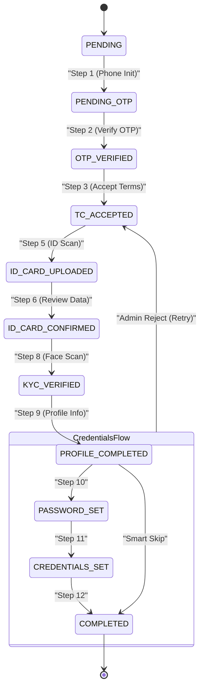
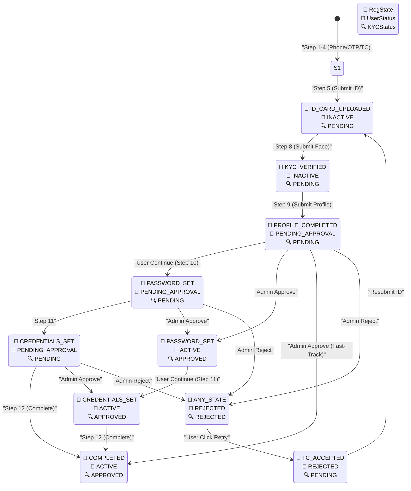
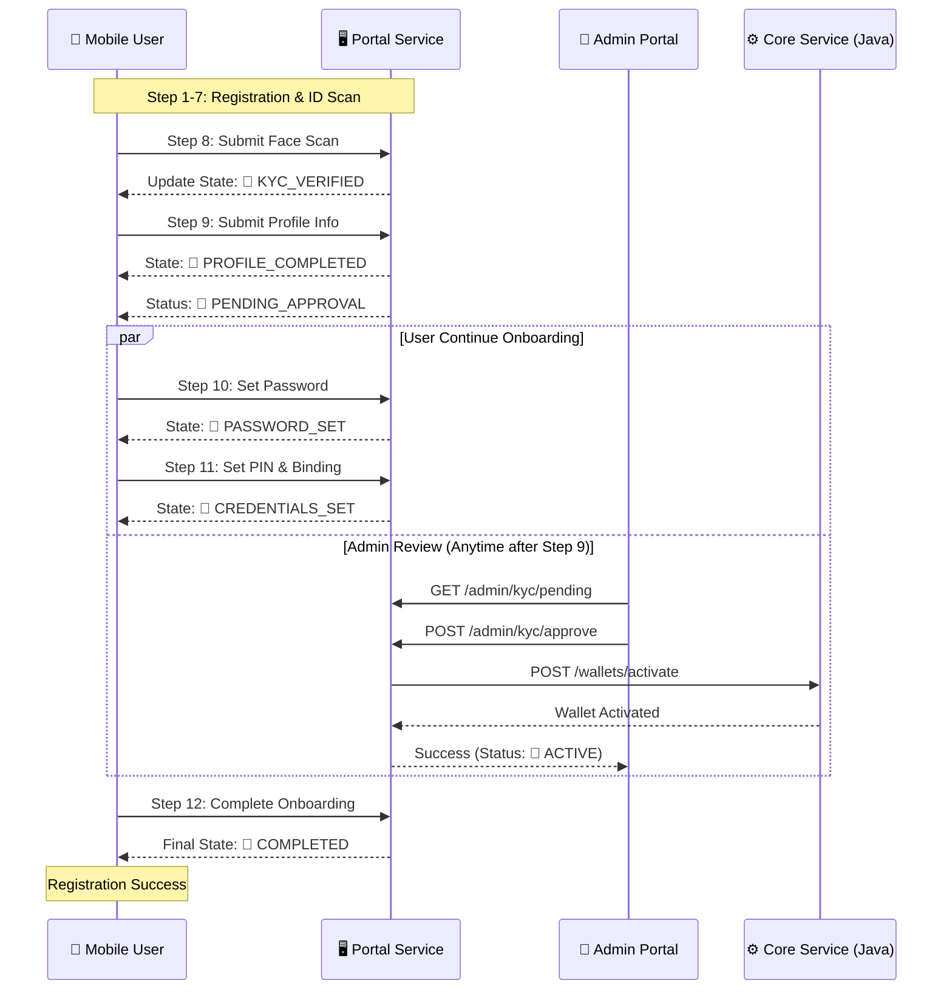
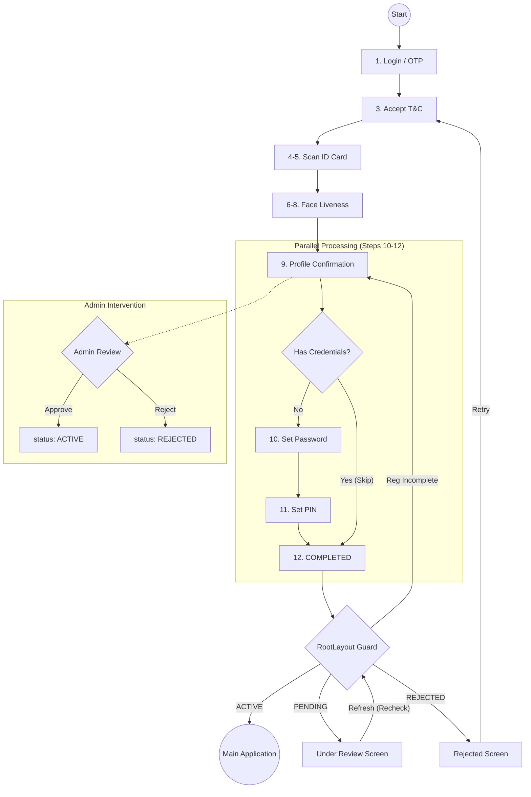

# 📱 J-Ledger: 12-Step Mobile Onboarding Reference

เอกสารนี้สรุปขั้นตอนการลงทะเบียน (Registration Flow) ทั้ง 12 ขั้นตอนของ J-Ledger เพื่อใช้เป็นโครงสร้างหลักสำหรับ AI Agent ในการตรวจสอบโค้ดในโปรเจกต์ `wallet-api` (NestJS) และ `wallet-app` (Expo)

---

## 🏗️ Registration State Machine Overview

การเปลี่ยนสถานะ (State Transitions) จะต้องเรียงลำดับอย่างเคร่งครัดตามแผนภาพนี้:
`PENDING_OTP` -> `OTP_VERIFIED` -> `TC_ACCEPTED` -> `ID_CARD_UPLOADED` -> `KYC_VERIFIED` -> `PROFILE_COMPLETED` -> `PASSWORD_SET` -> `CREDENTIALS_SET` -> `COMPLETED`

---

## 🌊 The 12 Steps Detailed Flow

| Step | Action Name | API Endpoint | Description | Registration State | User Status |
| :--- | :--- | :--- | :--- | :--- | :--- |
| **1** | **Phone Init** | `POST /auth/register/init` | กรอกเบอร์มือถือเพื่อขอ OTP | `PENDING_OTP` | `INACTIVE` |
| **2** | **OTP Verification** | `POST /auth/register/verify-otp` | ยืนยัน OTP และรับ `regToken` | `OTP_VERIFIED` | `INACTIVE` |
| **3** | **Accept Terms** | `POST /auth/register/accept-terms` | ยอมรับ PDPA | `TC_ACCEPTED` | `INACTIVE` |
| **4** | **ID Scan Guide** | `GET /auth/register/status` | หน้าแนะนำการถ่ายรูปบัตร | (No Change) | `INACTIVE` |
| **5** | **ID Scan** | `POST /kyc/id-card` | ส่งรูปบัตรทำ OCR | `ID_CARD_UPLOADED` | `INACTIVE` |
| **6** | **ID Data Review** | `GET /auth/register/status` | User ตรวจสอบข้อมูล PII | (No Change) | `INACTIVE` |
| **7** | **Face Scan Guide**| `GET /auth/register/status` | หน้าแจ้งเตือนก่อนสแกนหน้า | (No Change) | `INACTIVE` |
| **8** | **Face Scan** | `POST /kyc/selfie` | สแกนหน้า (Liveness) | `KYC_VERIFIED` | `PENDING_APPROVAL` |
| **⌛** | **Admin Review** | `POST /admin/kyc/approve` | **แอดมินตรวจสอบและอนุมัติ** | (No Change) | **`ACTIVE`** |
| **9** | **Profile Info** | `POST /auth/register/profile` | กรอกที่อยู่และอาชีพเพิ่มเติม | `PROFILE_COMPLETED` | `ACTIVE` / `PENDING` |
| **10** | **Password** | `POST /auth/register/password` | ตั้งค่ารหัสผ่าน | `PASSWORD_SET` | `ACTIVE` / `PENDING` |
| **11** | **PIN & Binding** | `POST /auth/register/pin` | ตั้ง PIN + ผูกอุปกรณ์ | `CREDENTIALS_SET` | `ACTIVE` / `PENDING` |
| **12** | **Success** | `POST /auth/register/complete` | เปิดใช้งานบัญชีสมบูรณ์ | `COMPLETED` | `ACTIVE` |

> [!TIP]
> **Smart Skip (Retry Flow)**: ใน Step 9 หากระบบตรวจพบว่าผู้ใช้เคยตั้ง Password และ PIN ไว้แล้ว (จากการสมัครครั้งก่อนที่โดน Reject) ระบบจะดีดสถานะข้ามไปที่ Step 12 (`COMPLETED`) ทันที เพื่อความรวดเร็ว

---

### 💡 สำคัญ: สถานะคู่ขนาน (Parallel Status)
- **Registration State**: ควบคุมลำดับหน้าจอบน Mobile (12 ขั้นตอน)
- **User Status**: ควบคุมสิทธิ์การทำธุรกรรม (ต้องเป็น `ACTIVE` ถึงจะโอนเงินได้)
- **Admin Approval**: สามารถเกิดขึ้นได้ทันทีหลังจาก Step 8 โดยไม่ขัดจังหวะการทำ Step 9-11 ของผู้ใช้

---

## 📊 Visual Diagrams

### 1. Mobile Registration Flow (12 Steps)
เน้นลำดับการเปลี่ยนหน้าจอบนแอปมือถือ

### 2. Comprehensive System State (Triple-State Mapping)
แผนผังการทำงานร่วมกันของทั้ง 3 สถานะ (RegState | UserStatus | KYCStatus)

### 3. Parallel Approval Workflow (Sequence Diagram)
แสดงการทำงานคู่ขนานระหว่าง User (ทำขั้นตอนที่เหลือ) และ Admin (กดอนุมัติ)

---

## 🚦 Status Reference Guide

เพื่อให้เห็นภาพรวมของสถานะต่างๆ ที่ทำงานพร้อมกัน ระบบจะแบ่งสถานะออกเป็น 3 ชุดหลัก:

### 1. 📱 User Registration State (12 Steps)
ใช้ควบคุม **หน้าจอบน Mobile App** ว่าผู้ใช้อยู่ขั้นตอนไหน
- `PENDING_OTP`: เริ่มต้นกรอกเบอร์
- `OTP_VERIFIED`: ยืนยันตัวตนเบอร์โทรแล้ว
- `TC_ACCEPTED`: ยอมรับเงื่อนไขแล้ว
- `ID_CARD_UPLOADED`: ถ่ายรูปบัตรประชาชนแล้ว
- `KYC_VERIFIED`: สแกนหน้าผ่านแล้ว (จบขั้นตอน KYC พื้นฐาน)
- `PROFILE_COMPLETED`: กรอกที่อยู่/อาชีพแล้ว
- `PASSWORD_SET`: ตั้งรหัสผ่านแล้ว
- `CREDENTIALS_SET`: ตั้ง PIN และผูกเครื่องแล้ว
- `COMPLETED`: จบกระบวนการลงทะเบียน 100%

### 2. 👔 User Status (Administrative)
ใช้ควบคุม **สิทธิ์ในการใช้งานระบบ/ธุรกรรม** (Admin เป็นคนคุม)
- `INACTIVE`: สถานะเริ่มต้น (ยังทำ KYC ไม่เสร็จ)
- `PENDING_APPROVAL`: ส่ง KYC ครบแล้ว รอแอดมินตรวจ
- `ACTIVE`: แอนมินอนุมัติแล้ว (ใช้งานกระเป๋าเงินได้)
- `REJECTED`: แอดมินไม่อนุมัติ (ต้องแก้ไขข้อมูล)
- `SUSPENDED / BLOCKED`: ระงับการใช้งานชั่วคราว/ถาวร

### 3. 🔍 KYC Verification Status (Internal)
ใช้ควบคุม **สถานะเฉพาะของข้อมูล KYC** ในตาราง `kyc_data`
- `PENDING`: ข้อมูลใหม่ รอการตรวจสอบ
- `APPROVED`: ข้อมูลถูกต้อง
- `REJECTED`: ข้อมูลไม่ถูกต้อง (รูปไม่ชัด, ข้อมูลไม่ตรง)

---

## 🔗 Status Synchronization Logic

| Event | Registration State Change | User Status Change | KYC Status Change |
| :--- | :--- | :--- | :--- |
| **สแกนหน้าผ่าน (Step 8)** | `-> KYC_VERIFIED` | `-> PENDING_APPROVAL` | `-> PENDING` |
| **แอดมินกดอนุมัติ (Approve)** | `(Stay or Advance)` | `-> ACTIVE` | `-> APPROVED` |
| **แอดมินกดปฏิเสธ (Reject)** | `(Stay)` | `-> REJECTED` | `-> REJECTED` |
| **User กดขอยื่นใหม่ (Retry)** | `-> TC_ACCEPTED` (Step 3) | `(Stay REJECTED)` | `-> REJECTED` |

---

## 🛠️ Technical Implementation Notes for Agent

### 1. Persistence & Resumption
- **Sync Logic:** เมื่อแอปเริ่มทำงาน ต้องเรียก `GET /auth/register/status` เสมอเพื่อดึงสถานะล่าสุดจาก Backend
- **Guard Enforcement:** ใน NestJS ทุก API ต้องมี `RegistrationGuard` เพื่อเช็กว่า User อยู่ในสถานะที่ถูกต้องก่อนประมวลผล

### 2. Security Hardening
- **Stable Device ID:** ใช้ `expo-secure-store` ร่วมกับ `deviceId` เพื่อผูกเครื่องใน Step 11
- **Deep Validation:** API ขั้นตอนที่ 12 (`/complete`) ต้องทำการตรวจสอบข้อมูล (Profile, KYC, S3 Media) แบบละเอียดก่อนสร้าง `LedgerOutbox`

### 3. Data Consistency (Outbox Pattern)
- เมื่อ Step 12 สำเร็จ ระบบต้องบันทึกเหตุการณ์ลงใน `LedgerOutbox` ในทรานแซกชันเดียวกัน (Atomic Write) เพื่อให้ `j-ledger-core` (Java) นำไปสร้างบัญชีเงินฝากจริง

---

## 4. System Logic Flowchart

แสดงภาพรวมการไหลของข้อมูลและการตัดสินใจของระบบ (System Decision Tree)

---

## 5. Summary of Guard Priorities
เพื่อให้ระบบมีความแม่นยำสูงและไม่มีสถานะตกค้าง (Zero-Deadlock), `RootLayout` จะยึดถือลำดับความสำคัญดังนี้:

1. **Completion First (12 Steps)**: ตราบใดที่ `registrationState !== 'COMPLETED'` ระบบจะบังคับให้ผู้ใช้อยู่ในหน้า `onboarding` เสมอ เพื่อให้ตั้งรหัสผ่านและ PIN ให้จบ (ห้ามข้าม)
2. **Status Second (Final Decision)**: เมื่อลงทะเบียนครบ 12 ขั้นตอนแล้ว ระบบถึงจะมาตัดสินตาม `user.status`:
   - `ACTIVE` -> เข้าสู่ Main App (`(tabs)`)
   - `PENDING_APPROVAL` / `REJECTED` -> เข้าสู่หน้าสถานะ (`pending-approval`)

---

**Note to Agent:** กรุณาตรวจสอบให้มั่นใจว่า Logic ทั้งหมดทำงานสอดคล้องกับลำดับความสำคัญข้างต้น