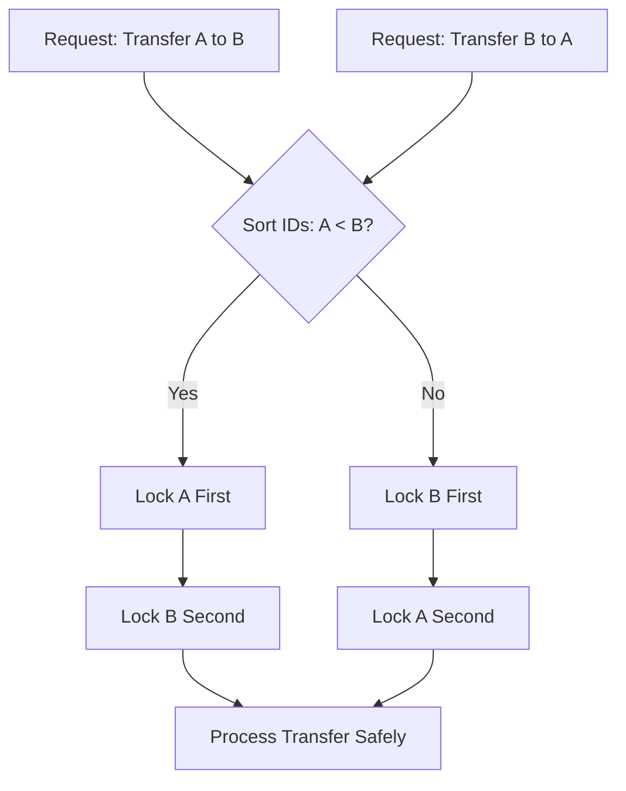
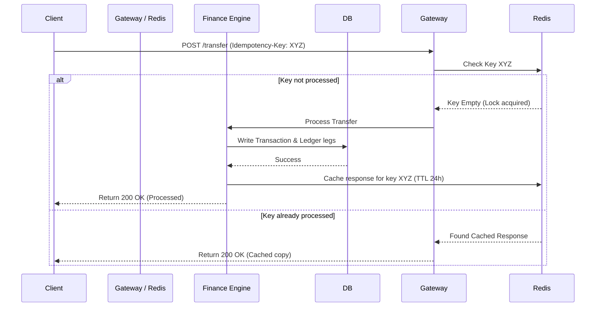

# J-Ledger Financial Engineering & Security Guidelines 🏦

Welcome to the definitive architectural and engineering handbook for J-Ledger's financial engine. This document establishes the core mathematical, operational, and security principles that govern balance mutations, currency transactions, liquidity management, and compliance rules in a modern, production-grade ledger microservice.

---

## 🏛️ 1. Immutability & Double-Entry Bookkeeping

In a high-integrity financial platform, money is never represented as a single mutable balance field in a user database without a strict, mathematically sound audit trail. Balance mutations in J-Ledger strictly conform to the **double-entry bookkeeping paradigm**.

### The Fundamental Accounting Equation
Every financial event must balance across assets, liabilities, and equity:
$$\text{Assets} = \text{Liabilities} + \text{Equity}$$

In an E-Wallet ecosystem:
* **Assets**: System cash held in custodian bank accounts (e.g. SCB, KBank) or processor balances (Stripe).
* **Liabilities**: Customer wallet balances (which the system owes back to the users on demand).

### Append-Only Immutable Ledgers
To protect against fraud, balance tampering, and database corruption:
* **Rule of Zero Mutation**: No ledger line-item record is ever updated (`UPDATE`) or deleted (`DELETE`).
* **Correction via Reversal**: If a transaction is incorrect or failed, a new reversing transaction is recorded as a separate ledger entry with matching assets/liabilities legs in the opposite direction.
* **Audit Split**: Every top-up, P2P transfer, or payment records two distinct `LedgerEntry` entries:
  - **DEBIT leg**: Left-hand entry representing an increase in assets or decrease in liabilities.
  - **CREDIT leg**: Right-hand entry representing a decrease in assets or increase in liabilities.

> [!IMPORTANT]
> A ledger is a permanent journal. In J-Ledger, the ledger is protected by foreign key constraints and transactional outbox logs to guarantee that a balance update on a `Wallet` is never detached from its dual `LedgerEntry` records.

---

## 🔒 2. High-Throughput Concurrency & Deadlock Prevention

When millions of users trigger transfers, top-ups, and merchant payments concurrently, race conditions and deadlocks are primary vectors for financial loss and system downtime.

### The Circular Wait Problem (Deadlocks)
If User A transfers to User B, and User B simultaneously transfers to User A:
1. Thread 1 locks User A's wallet and waits for User B's lock.
2. Thread 2 locks User B's wallet and waits for User A's lock.
This leads to a **circular wait deadlock**, freezing the application threads until a database timeout occurs.

### Lexicographical Sorted Lock Sequencing
J-Ledger prevents deadlocks deterministically without relying on slow database-level lock escalations by enforcing **lexicographical lock sorting**:
* When updating balances across two wallets (e.g., in `TransferService`), the system evaluates the two wallet identifiers (e.g., database primary key IDs or UUIDs).
* The wallet with the smaller ID is always locked first:
  $$\text{LockOrder} = \text{sort}(\text{walletId}_A, \text{walletId}_B)$$
* This guarantees that concurrent threads accessing the same pair of wallets will always attempt to acquire locks in the exact same sequence, breaking the circular wait condition.



> [!TIP]
> Database locks (`SELECT ... FOR UPDATE`) are used exclusively inside pessimistic transactions. In high-contention systems, distributed lock keys in Redis (using Redisson) are utilized at the endpoint gateway level to fail fast, preserving database resource availability.

---

## 📐 3. Decimal Precision & Banker's Rounding

Floating-point data types (`double`, `float`) are binary approximations (IEEE 754 standard) and are **strictly forbidden** for monetary representations. Using them results in cumulative rounding leakages that corrupt financial audits.

### BigDecimal and Explicit Scaling
J-Ledger mandates the use of Java's `BigDecimal` class for all currency calculations, standardizing on a **4-decimal place scale** (e.g. `100.0000` THB) to support sub-unit pricing and fractional transaction fees:

```java
BigDecimal amount = new BigDecimal("150.7500");
```

### Banker's Rounding (HALF_EVEN)
When rounding is required (such as calculating Merchant Discount Rates (MDR) or VAT), J-Ledger uses **Banker's Rounding** (`RoundingMode.HALF_EVEN`).
* Standard rounding (`HALF_UP`) rounds 5 upwards, which introduces a positive cumulative bias when summing rounded numbers over millions of transactions.
* `HALF_EVEN` rounds to the nearest even number when the digit is exactly in the middle, resulting in a statistically unbiased rounding sum over time.

$$\text{MDR Fee} = \text{Amount} \times \text{FeeRate}$$
$$\text{Rounded Fee} = \text{MDR Fee.setScale}(4, \text{RoundingMode.HALF_EVEN})$$

---

## 🏦 4. Corporate Treasury, Sweeping & Solvency Auditing

Unlike traditional fractional-reserve banks, modern E-Wallets must maintain 100% solvency backing. Every unit of customer liability in the database must be backed by cash or liquid equivalents held in custodian corporate bank accounts.

### Custodian Solvency Reserve Ratio
J-Ledger implements automated corporate sweeping audits via the `TreasuryService` to measure systemic solvency in real time:
* **Total Customer Liabilities**: Sum of all active user wallet balances.
* **Liquid Assets**: Stripe balance (receivables) + Corporate bank accounts balance (SCB main account, KBank payout reserve, etc.).
* **Solvency Reserve Ratio Calculation**:
  $$\text{Reserve Ratio} = \frac{\text{Stripe Balance} + \text{Total Bank Balances}}{\text{Total Customer Liabilities}} \times 100$$

> [!WARNING]
> A healthy system must maintain a Reserve Ratio of $\ge 100.00\%$. If the ratio falls below $100\%$, it indicates a severe liquidity deficit (the platform has spent or lost backing assets), triggering automated high-priority compliance alarms.

---

## 🕵️ 5. Compliance, AML Rules & Fraud Safeguards

Compliance with Anti-Money Laundering (AML) standards is vital for maintaining operating licenses and preventing illicit money routing. J-Ledger's `AmlMonitoringService` and `FraudPatternDetectionService` enforce a set of real-time heuristic triggers:

### Heuristic AML Rule Engines

| Alert / Pattern Type | Regulatory Trigger Condition | Security Action |
| :--- | :--- | :--- |
| **Large Transaction Threshold** | Single transfer exceeding $100,000$ THB | Save `LARGE_TRANSACTION` activity, log high-risk score, queue for AMLO reporting. |
| **Structuring / Smurfing** | 5+ transactions between $94,000$ and $99,999$ THB within 1 hour | Flags evasion attempts designed to bypass the $100,000$ THB AMLO report threshold. |
| **Layering** | Funds routed to 3+ unique accounts within 24 hours | Identifies attempts to obscure the origin of funds. |
| **High Frequency Velocity** | 10+ transactions per hour | Throttles account and flags for automated bot activity. |
| **Rapid Account Takeover (ATO)** | Credential/device change followed by immediate maximum limit transfer | Automatically freezes wallet and locks funds pending identity re-verification. |

> [!CAUTION]
> Once a fraud pattern flags a risk score $\ge 60$, the system automatically moves the suspicious activity status to `FLAGGED` and raises a webhook notification to security staff for manual KYC audit.

---

## 🔄 6. Idempotency & Safe Retries

Network failures are a certainty. In e-commerce and P2P transfers, a network timeout must never result in duplicate charges or double transfers.

### Idempotency Keys (The Contract)
All mutate requests require a unique client-generated UUID (the `Idempotency-Key` header):
1. **First Attempt**: System receives request, checks if the key exists in Redis/Database. If empty, it locks the key, processes the transfer, records the transaction, caches the successful transaction entity in Redis, and returns the response.
2. **Subsequent Attempts (Retries)**: If a client retries due to a timeout, the system intercepts the request, finds the cached response matching the `Idempotency-Key`, and returns the cached result instantly without executing any duplicate database writes.



### Double-Entry Integrity on External Conflicts
If external providers (such as Stripe webhooks or corporate sweeps) fire concurrent callbacks for the same payment reference, J-Ledger leverages database unique constraints (e.g. `reference_id`) in a `DataIntegrityViolationException` catch block to safely handle and return the original transaction, guaranteeing zero double-crediting.
