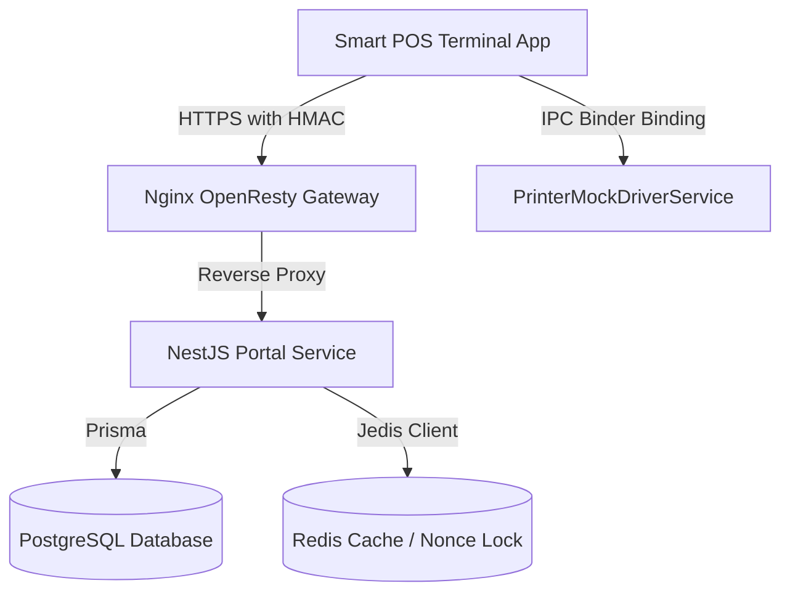

# J-Ledger Smart POS Terminal Application Context Reference

This document serves as the absolute source of truth and architectural reference for the J-Ledger Smart POS Terminal Application (`pos-terminal-app`). Refer to this guide when returning to update or maintain this codebase.

---

## 🏗️ 1. System Architecture Overview

The `pos-terminal-app` is a modular, native Android application written in Kotlin utilizing modern developer stacks. It represents a secure hardware edge device in the J-Ledger fintech network.



### Key Technical Stack:
- **UI Framework**: Jetpack Compose & Material 3 (WOW Premium Dark Palette).
- **Core State**: Android Architecture Components `ViewModel` with coroutines and flows.
- **Networking**: Retrofit 2 + OkHttp 4 client.
- **Security Storage**: Android Keystore + `EncryptedSharedPreferences`.
- **Barcodes / Scanning**: CameraX API + Google ML Kit Barcode Analyzer.
- **Hardware Integration**: Android IPC Service Binding via AIDL (`IPrinterService`).

---

## 🔒 2. Security & Cryptographic Handshakes

To ensure that POS transactions cannot be tampered with or replayed, every outbound API call is cryptographically signed using **HMAC-SHA256**.

### The Signature Formula:
The signature is computed over a merged metadata string, exactly matching the backend gateway verification filter:
$$\text{Signature} = \text{HMAC-SHA256}(\text{key} = \text{SecretKey}, \text{data} = \text{METHOD} + ":" + \text{path} + ":" + \text{timestamp} + ":" + \text{nonce})$$

*   **`METHOD`**: Must be converted to UPPERCASE (e.g. `POST`, `GET`).
*   **`path`**: The absolute path including queries (e.g. `/api/v1/terminal/payment` or `/api/merchant/deals/redemptions/code123/verify`).
*   **`timestamp`**: Current unix epoch timestamp in seconds (e.g. `1716912000`). Checked by backend's `TerminalNonceService` against a 5-minute sliding replay window.
*   **`nonce`**: A unique UUID v4 random string. Verified by backend to prevent double-spending / replay attacks (uses Redis `SET NX EX 600` lock).

### Mandatory HTTP Headers:
Every API call from the terminal injects these 4 headers:
1. `X-JLedger-Terminal-Id`: The unique identifier of this terminal (e.g. `POS-T1790`).
2. `X-JLedger-Signature`: Lowercase 64-character hexadecimal HMAC signature.
3. `X-JLedger-Timestamp`: Current seconds timestamp string.
4. `X-JLedger-Nonce`: The UUID v4 nonce string.

---

## 📡 3. Unified Nginx Proxy & Backend Routes

The Nginx Gateway routes incoming terminal requests securely inside the `jledger-network`.

### Whitelisted Environment Variables
Nginx worker processes strip environment variables by default. To support `os.getenv("REDIS_PASSWORD")` inside the OpenResty Lua IP-blacklist block, a custom [nginx.conf](file:///Users/wiiznu/project/fintech/docker/nginx/nginx.conf) is mounted to the container root context, declaring:
```nginx
env REDIS_PASSWORD;
```

### Configured Gateway Proxy Paths
The following proxy blocks are established inside [default.conf](file:///Users/wiiznu/project/fintech/docker/nginx/default.conf#L144-L163) with upload sizes (`client_max_body_size 10m`) and proxy timeouts (10s connect, 30s read/write):
- **`/api/v1/terminal/`** ➔ `http://portal-service:3000/api/v1/terminal/` (Payment and Loyalty Points)
- **`/api/merchant/`** ➔ `http://portal-service:3000/api/merchant/` (Vouchers/Deals Verification)

### NestJS Route Bug Fix:
> [!IMPORTANT]
> A critical double-prefixing route bug was fixed in [MerchantDealController](file:///Users/wiiznu/project/fintech/j-ledger-portal/apps/portal-service/src/modules/merchant/merchant-deal.controller.ts#L14). The decorator was corrected from `@Controller('api/merchant/deals')` to `@Controller('merchant/deals')`. Because NestJS already has a global `'api'` prefix, the old routing mapped erroneously to `/api/api/merchant/deals`. The fix restores standard `/api/merchant/deals/...` path compatibility.

---

## 🖨️ 4. Thermal Printer IPC Integration (AIDL)

To mock professional hardware devices (such as PAX or Verifone), the printer runs in a separate background service and communicates using Android's **Inter-Process Communication (IPC)** binder.

### IPC Interface ([IPrinterService.aidl](file:///Users/wiiznu/project/fintech/j-ledger-portal/apps/pos-terminal-app/app/src/main/aidl/com/jledger/pos/IPrinterService.aidl)):
1. `getPrinterStatus()`: Returns `0` (Ready/OK), `1` (Out of paper), `2` (Overheat).
2. `printText(String text)`: Prints formatted receipt strings onto thermal paper.
3. `printBitmap(byte[] bitmap)`: Prints graphical logos or barcode slip images.
4. `cutPaper()`: Cuts the receipt slip paper.

### Integration in ViewModel:
- Binds to `PrinterMockDriverService` on initialization via `bindService()` and service connections.
- On successful API calls (Sale, Loyalty Points, or Vouchers), generates a beautifully padded receipt structure, prints, and cuts.
- Properly calls `unbindService()` inside `MainActivity.onDestroy()` to prevent service leakage.

---

## 🗂️ 5. Key Repository Files & Roles

| File Path | Role & Context |
| :--- | :--- |
| **[SecureStorage.kt](file:///Users/wiiznu/project/fintech/j-ledger-portal/apps/pos-terminal-app/app/src/main/java/com/jledger/pos/security/SecureStorage.kt)** | Uses Android Keystore to decrypt and encrypt terminal credentials in local SharedPreferences. |
| **[HmacSignature.kt](file:///Users/wiiznu/project/fintech/j-ledger-portal/apps/pos-terminal-app/app/src/main/java/com/jledger/pos/security/HmacSignature.kt)** | Generates lowercase hexadecimal HMAC-SHA256 signature hashes. |
| **[HmacInterceptor.kt](file:///Users/wiiznu/project/fintech/j-ledger-portal/apps/pos-terminal-app/app/src/main/java/com/jledger/pos/security/HmacInterceptor.kt)** | Intercepts retrofit outputs, creates unique UUID v4 nonces/timestamps, and attaches secure compliance headers. |
| **[NetworkModels.kt](file:///Users/wiiznu/project/fintech/j-ledger-portal/apps/pos-terminal-app/app/src/main/java/com/jledger/pos/network/NetworkModels.kt)** | Holds Gson serializable requests/responses for POS sales, loyalty, and voucher APIs. |
| **[PosApiService.kt](file:///Users/wiiznu/project/fintech/j-ledger-portal/apps/pos-terminal-app/app/src/main/java/com/jledger/pos/network/PosApiService.kt)** | Mapped Retrofit routing interface pointing to Nginx gateway proxy path values. |
| **[ApiClient.kt](file:///Users/wiiznu/project/fintech/j-ledger-portal/apps/pos-terminal-app/app/src/main/java/com/jledger/pos/network/ApiClient.kt)** | Configures and instantiates OkHttpClient with `HmacInterceptor` and logger attachments. |
| **[PosViewModel.kt](file:///Users/wiiznu/project/fintech/j-ledger-portal/apps/pos-terminal-app/app/src/main/java/com/jledger/pos/PosViewModel.kt)** | Handles async API coroutine calls, UI page transitions, dynamic numpads, and binds to printer AIDL drivers. |
| **[MainActivity.kt](file:///Users/wiiznu/project/fintech/j-ledger-portal/apps/pos-terminal-app/app/src/main/java/com/jledger/pos/MainActivity.kt)** | Jetpack Compose high-fidelity screens, Google ML Kit scanning integration, and lifecycle camera binding. |
| **[HmacSignatureTest.kt](file:///Users/wiiznu/project/fintech/j-ledger-portal/apps/pos-terminal-app/app/src/test/java/com/jledger/pos/HmacSignatureTest.kt)** | JUnit tests ensuring deterministic signatures and sensitive inputs changes triggers. |

---

## 🛠️ 6. Verification & Validation Rules

### Type Integrity Check
The workspace remains 100% type-safe. Run validation from `j-ledger-portal` monorepo:
```bash
npm run check-types
```

### Running Cryptographic Tests
Verify signature correctness against pre-defined test vectors:
```bash
./gradlew testDebugUnitTest --project-dir=j-ledger-portal/apps/pos-terminal-app
```
