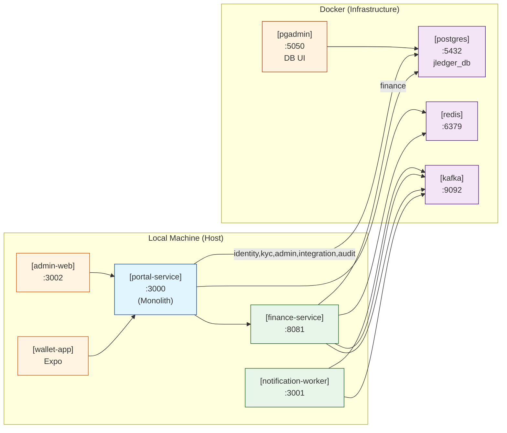
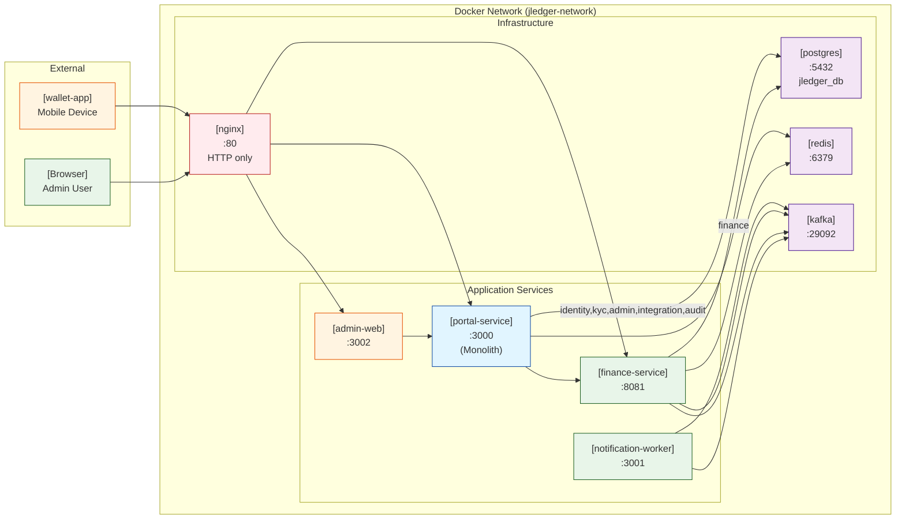
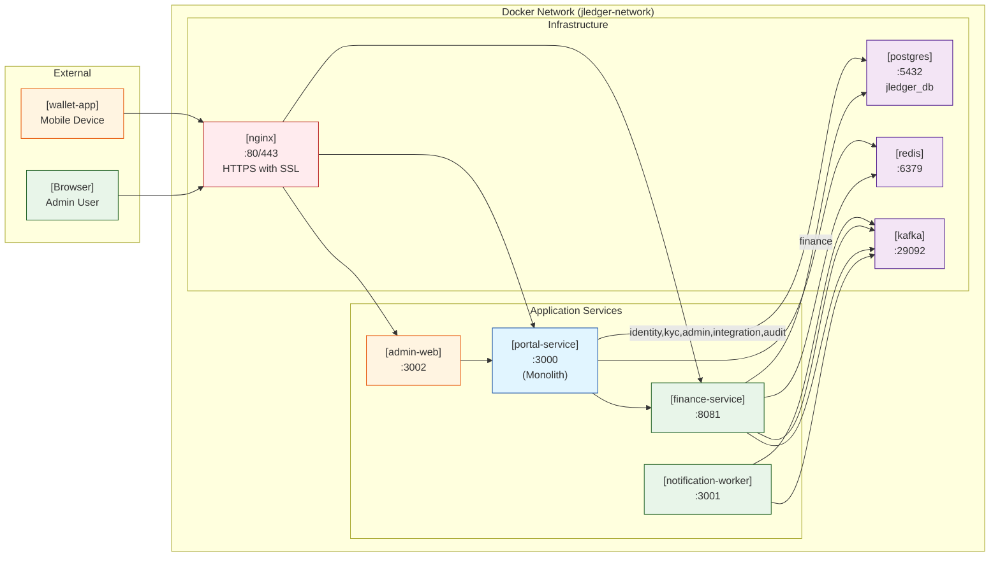

# การตั้งค่าเครือข่าย J-Ledger 🌐

เอกสารนี้แสดงภาพการเชื่อมต่อ (Network Communication) ระหว่างส่วนประกอบต่างๆ ในแต่ละสภาพแวดล้อม

## 📝 Nginx Configuration

- `docker/nginx/default.conf` - Production (HTTPS with SSL, potayyr.site) - Public NGINX
- `docker/nginx/default.conf.example` - Local development (HTTP only, localhost) - สำหรับ Local Test

**Usage:**

- **Mode 1 (Dev/Hybrid)**: ไม่ใช้ nginx - เข้า services โดยตรงผ่าน localhost:port
- **Mode 2 (Local Test)**: `docker compose -f docker-compose.yml -f docker-compose.test.yml up -d` (uses `default.conf.example` for HTTP only)
- **Mode 3 (Production)**: `docker compose up -d` (uses `default.conf` with SSL for public traffic)

## 1. 🛠️ โหมด Hybrid Development (แนะนำสำหรับการพัฒนา)

**รูปแบบ**: โครงสร้างพื้นฐาน (Infra) รันใน **Docker**, ส่วนบริการแอปพลิเคชัน (Services) รันใน **เครื่อง Local** (macOS)

> [!NOTE]
> **ทำไม Dev Mode ไม่ใช้ Nginx?**
>
> - Dev mode เข้าถึง Services โดยตรงผ่าน `localhost:port` เพื่อความสะดวกในการ Debug
> - ไม่ต้องการ SSL termination (HTTPS) ในการพัฒนา
> - ไม่ต้องการ Reverse proxy routing
> - Nginx ใช้ใน Production เพื่อ:
>   - SSL/TLS termination
>   - Load balancing
>   - Security (ซ่อน internal ports)
>   - Centralized routing

**คำสั่งเริ่มใช้งาน:**

```bash
# 1. เริ่ม Infrastructure ใน Docker
docker compose -f docker-compose.yml -f docker-compose.dev.yml up -d postgres redis kafka zookeeper pgadmin

# 2. รัน Services บนเครื่อง Local
cd j-ledger-portal/apps/portal-service && npm run dev
cd j-ledger-core/finance-service && ./mvnw spring-boot:run
cd j-ledger-portal/apps/notification-worker && npm run start:dev

# 3. รัน Frontend (ถ้าต้องการ)
cd j-ledger-portal/apps/admin-web && npm run dev
cd j-ledger-portal/apps/wallet-app && npx expo start
```


```mermaid
graph LR
    subgraph "Local Machine (Host)"
        direction TB
        WEB["[admin-web]<br/>:3002"]
        APP["[wallet-app]<br/>Expo"]
        PORTAL["[portal-service]<br/>:3000<br/>(Monolith)"]
        FIN["[finance-service]<br/>:8081"]
        WORK["[notification-worker]<br/>:3001"]
    end

    subgraph "Docker (Infrastructure)"
        direction TB
        PG["[postgres]<br/>:5432<br/>jledger_db"]
        REDIS["[redis]<br/>:6379"]
        KAFKA["[kafka]<br/>:9092"]
        PGADMIN["[pgadmin]<br/>:5050<br/>DB UI"]
    end

    %% Service Connections
    WEB --> PORTAL
    APP --> PORTAL
    PORTAL --> FIN
    WORK --> KAFKA
    FIN --> KAFKA
    PGADMIN --> PG

    %% Database Connections
    PORTAL -->|identity,kyc,admin,integration,audit| PG
    FIN -->|finance| PG

    %% Cache Connections
    PORTAL --> REDIS
    FIN --> REDIS

    %% Kafka Connections
    FIN --> KAFKA
    WORK --> KAFKA

    style WEB fill:#fff4e1,stroke:#e65100
    style APP fill:#fff4e1,stroke:#e65100
    style PORTAL fill:#e1f5ff,stroke:#0d47a1
    style FIN fill:#e8f5e9,stroke:#1b5e20
    style WORK fill:#e8f5e9,stroke:#1b5e20
    style PG fill:#f3e5f5,stroke:#4a148c
    style REDIS fill:#f3e5f5,stroke:#4a148c
    style KAFKA fill:#f3e5f5,stroke:#4a148c
    style PGADMIN fill:#fff3e0,stroke:#bf360c
```

> [!NOTE]
> **pgadmin (Database Management UI):**
>
> - Access: http://localhost:5050
> - Email: admin@jledger.com
> - Password: admin_password
> - Purpose: PostgreSQL database management through web interface

---

## 2. 🧪 โหมด Local Test (Full Docker)

**รูปแบบ**: **ทุกอย่าง** รันอยู่ภายใน Docker บนเครือข่ายเดียวกัน (`jledger-network`)

**คำสั่งเริ่มใช้งาน:**

```bash
docker compose -f docker-compose.yml -f docker-compose.test.yml up -d --build
```


```mermaid
graph LR
    subgraph "Docker Network (jledger-network)"
        direction TB
        subgraph "Application Services"
            WEB["[admin-web]<br/>:3002"]
            PORTAL["[portal-service]<br/>:3000<br/>(Monolith)"]
            FIN["[finance-service]<br/>:8081"]
            WORK["[notification-worker]<br/>:3001"]
        end

        subgraph "Infrastructure"
            PG["[postgres]<br/>:5432<br/>jledger_db"]
            REDIS["[redis]<br/>:6379"]
            KAFKA["[kafka]<br/>:29092"]
            NGINX["[nginx]<br/>:80<br/>HTTP only"]
        end
    end

    subgraph "External"
        APP["[wallet-app]<br/>Mobile Device"]
        BROWSER["[Browser]<br/>Admin User"]
    end

    %% Service Connections
    WEB --> PORTAL
    PORTAL --> FIN
    WORK --> KAFKA
    FIN --> KAFKA

    %% External Connections via Nginx
    APP --> NGINX
    BROWSER --> NGINX

    %% Database Connections
    PORTAL -->|identity,kyc,admin,integration,audit| PG
    FIN -->|finance| PG

    %% Cache Connections
    PORTAL --> REDIS
    FIN --> REDIS

    %% Kafka Connections
    FIN --> KAFKA
    WORK --> KAFKA

    %% Nginx Gateway
    NGINX --> PORTAL
    NGINX --> FIN
    NGINX --> WEB

    style WEB fill:#fff4e1,stroke:#e65100
    style APP fill:#fff4e1,stroke:#e65100
    style BROWSER fill:#e8f5e9,stroke:#1b5e20
    style PORTAL fill:#e1f5ff,stroke:#0d47a1
    style FIN fill:#e8f5e9,stroke:#1b5e20
    style WORK fill:#e8f5e9,stroke:#1b5e20
    style PG fill:#f3e5f5,stroke:#4a148c
    style REDIS fill:#f3e5f5,stroke:#4a148c
    style KAFKA fill:#f3e5f5,stroke:#4a148c
    style NGINX fill:#ffebee,stroke:#b71c1c
```

---

## 3. 🚀 โหมด Production (Full Docker)

**รูปแบบ**: **ทุกอย่าง** รันอยู่ภายใน Docker บนเครือข่ายเดียวกัน (`jledger-network`)

**คำสั่งเริ่มใช้งาน:**

```bash
docker compose up -d --build
```


```mermaid
graph LR
    subgraph "Docker Network (jledger-network)"
        direction TB
        subgraph "Application Services"
            WEB["[admin-web]<br/>:3002"]
            PORTAL["[portal-service]<br/>:3000<br/>(Monolith)"]
            FIN["[finance-service]<br/>:8081"]
            WORK["[notification-worker]<br/>:3001"]
        end

        subgraph "Infrastructure"
            PG["[postgres]<br/>:5432<br/>jledger_db"]
            REDIS["[redis]<br/>:6379"]
            KAFKA["[kafka]<br/>:29092"]
            NGINX["[nginx]<br/>:80/443<br/>HTTPS with SSL"]
        end
    end

    subgraph "External"
        APP["[wallet-app]<br/>Mobile Device"]
        BROWSER["[Browser]<br/>Admin User"]
    end

    %% Service Connections
    WEB --> PORTAL
    PORTAL --> FIN
    WORK --> KAFKA
    FIN --> KAFKA

    %% External Connections via Nginx
    APP --> NGINX
    BROWSER --> NGINX

    %% Database Connections
    PORTAL -->|identity,kyc,admin,integration,audit| PG
    FIN -->|finance| PG

    %% Cache Connections
    PORTAL --> REDIS
    FIN --> REDIS

    %% Kafka Connections
    FIN --> KAFKA
    WORK --> KAFKA

    %% Nginx Gateway
    NGINX --> PORTAL
    NGINX --> FIN
    NGINX --> WEB

    style WEB fill:#fff4e1,stroke:#e65100
    style APP fill:#fff4e1,stroke:#e65100
    style BROWSER fill:#e8f5e9,stroke:#1b5e20
    style PORTAL fill:#e1f5ff,stroke:#0d47a1
    style FIN fill:#e8f5e9,stroke:#1b5e20
    style WORK fill:#e8f5e9,stroke:#1b5e20
    style PG fill:#f3e5f5,stroke:#4a148c
    style REDIS fill:#f3e5f5,stroke:#4a148c
    style KAFKA fill:#f3e5f5,stroke:#4a148c
    style NGINX fill:#ffebee,stroke:#b71c1c
```

> [!NOTE]
> ใน **Production**: เราจะใช้พอร์ต `29092` สำหรับ Kafka เพื่อคุยกันภายใน Docker
> ใน **Development**: เราจะใช้พอร์ต `9092` เพื่อให้เครื่องเรา (Host) คุยกับ Kafka ใน Docker ได้

---
